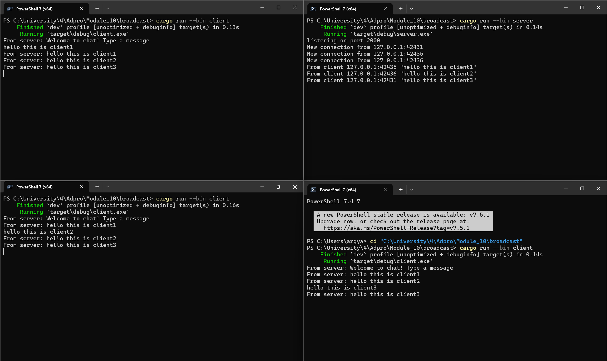
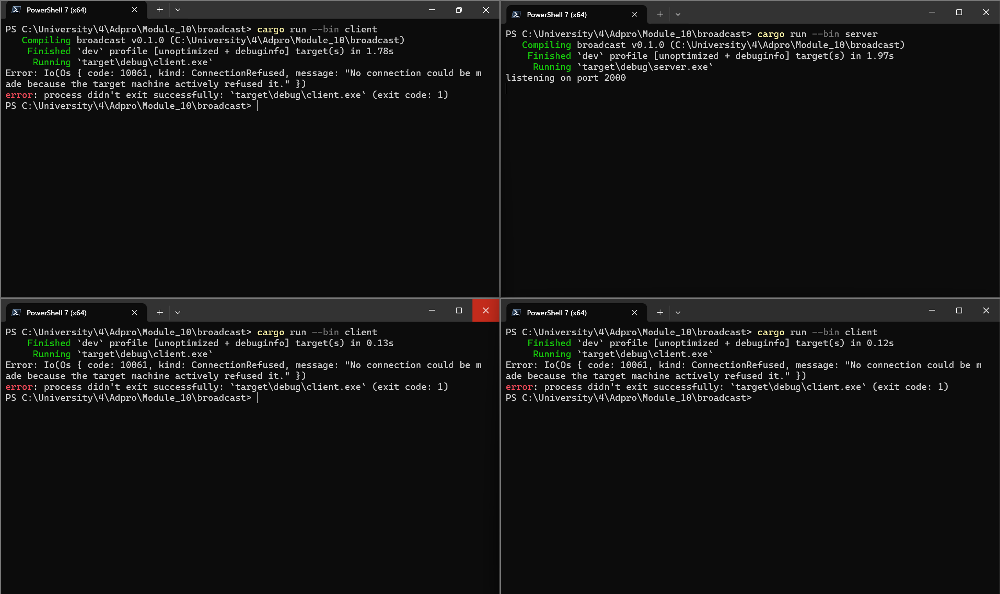
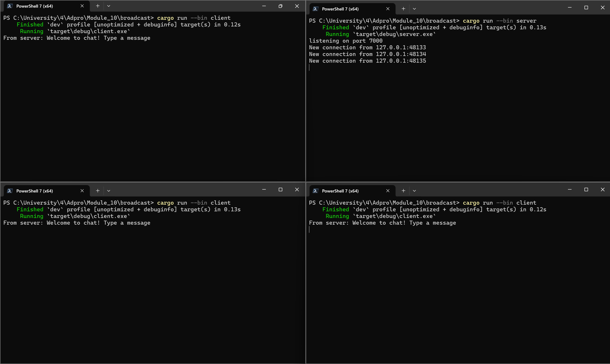
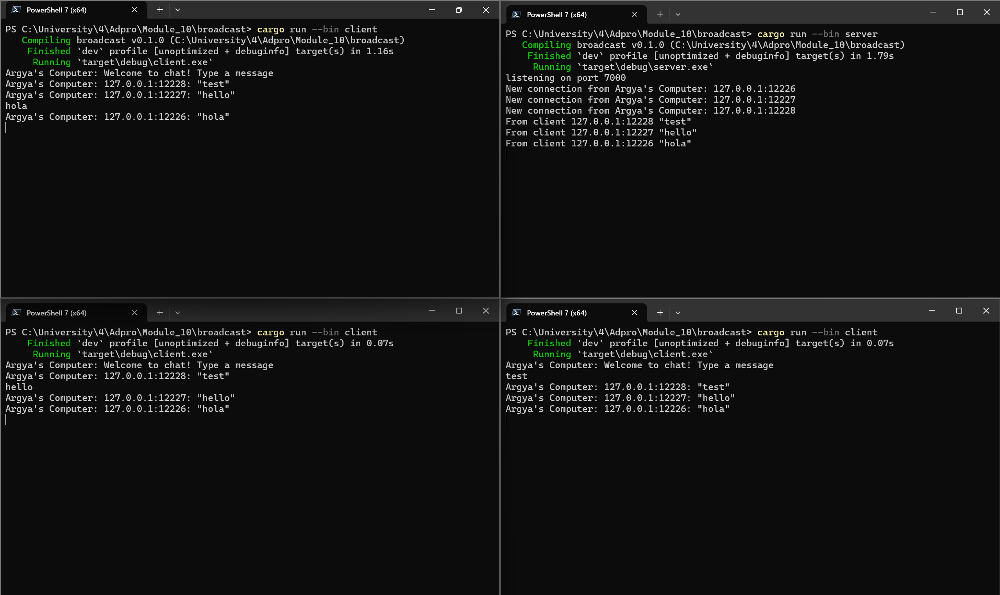

# Module 10 - Broadcast Chat

## Sending message from clients


### 2.1 How to run it
#### * Running the Server
```bash
cargo run --bin server
```

The server will start listening on port 2000. You should see a message indicating it's "Listening on port 2000".

#### * Running Clients
In separate terminal windows, run multiple clients:
```bash
cargo run --bin client
```
You can run as many clients as needed to participate in the chat.

### What happens when i type some text in the clients.

When you type a message in any client:
1. The message is sent to the server
2. The server receives the message and broadcasts it to all connected clients
Every client (including the sender) displays the message prefixed with "From server:"

## 2.2 Modifying Port

### Only changing the client port


In the image above, the client and server ports are different, where the server is waiting for a connection on port `2000`, while the client is trying to connect to a `websocket` running on port `7000`. However, since there is no `websocket` running on port `7000`, the client encounters a `ConnectionRefused` error, indicating that the client has attempted multiple times to connect to the `websocket` on port `7000`, but the connection was never successful.

### Also changing the server port



In server.rs i changed the port of the server in this part of the code below:

```bash
let listener = TcpListener::bind("127.0.0.1:7000").await?;
println!("listening on port 7000");
```
After changing the server port from `2000` to `7000`, the client was able to reconnect with the server as before. However, unlike the client which uses the `websocket` protocol to connect to the server, the server only listens for TCP connections on port `7000`, where the incoming connection is then upgraded to a `websocket` stream through code.

## 2.3  Small changes, add IP and Port



It can be seen from the image above that each broadcast from the server now includes information about which client sent the message. I was able to achieve this by modifying a section of code in `src/bin/server.rs`, specifically the part responsible for sending messages to all connected clients. I changed the line `bcast_tx.send(text.into())?;` to `bcast_tx.send(format!("{addr:?}: {text:?}"))?;`. With this change, whenever a client sends a message, the server will broadcast that message along with information indicating which client sent it.

